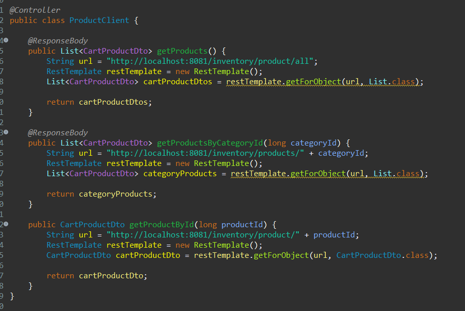

# Fibabank Speed Bootcamp Projesi    
>* Proje, 3 ayrı proje(mikroservis)den oluşmaktadır.
>* Üç mikroserviste aynı veritabanına bağlanmaktadır ancak her birinin kendine özel tablosu vardır 
>* Veritabanı teknolojisi olarak MySQL kullanılmıştır.

## Inventory
Inventory mikroservisi 8081 portu üzerinden çalışmaktadır.
  
> İçerisinde ürün ve kategori işlemlerinin yapılmasını sağlamak üzere ilgili paketlerin içinde entityler, controllerlar, dtolar ve repositoryler(interface) vardır. 

>* ProductController sınıfındaki getProduct() metodu veritabanındaki ürünleri çekmemizi sağlamaktadır.  
>   
>   
>   

>* ProductController sınıfındaki getProductsByCategoryId() metodu kategoriye göre ürünleri çekmemizi sağlamaktadır.  
>   
>   

>* ProductController sınıfındaki getAllProducts() metodu tüm ürünleri çekmemizi sağlamaktadır.  
>   

>* CategoryController sınıfındaki getCategories() metodu tüm kategorileri çekmemizi sağlamaktadır.  
>   
>   

## Shopping
Shopping mikroservisi 8082 portu üzerinden çalışmaktadır. 
  
>* CartController sınıfındaki createCart metodu ile sepet oluşturulabilmektedir. 
>   
> Onun altındaki addProductToCart metodu ile de sepete ürün eklenebilmektedir. 
>   
>   

CartController sınıfı içerisindeki checkout metodu ile sepet güncellenmekte ve removeProductInCart metodu ile de sepetten ürün silinebilmektedir.  
  

## Commerce
>* 8080 portunda çalışmaktadır.  
>* Bu kısımda ise diğer iki kısımdaki işler bir arada yapılabilmektedir. 
>* Controller metotları ve bir kısım arayüz işlemleri yapılabilmektedir. 
>* Önceki iki mikroservisteki metotlar CategoryClient, ProductClient, CartClient (aslında controller) sınıfları ile çağırılmaktadır. 
>   
> Zaman darlığından dolayı sadece product ve category için index sayfası hazırlayabildim. 
> index.html'de category'ler görüntülenmekte ve ilgili kategoriye tıkladığımızda bize o kategoriye ait ürünleri göstermektedir. 
>*   
>* kategoriye tıkladığımızda ise o kategoriye ait ürünlerin olduğu sayfaya gideriz 
>*   
>* Yine ürünlere de tıklayınca ürünün detayının görüntülendiği sayfaya gideriz. 
>*   

>* Cart ve CartProduct işlemleri sadece metotları tanımlanabilmiştir.(Zaman darlığından dolayı) 
>*   
>*   